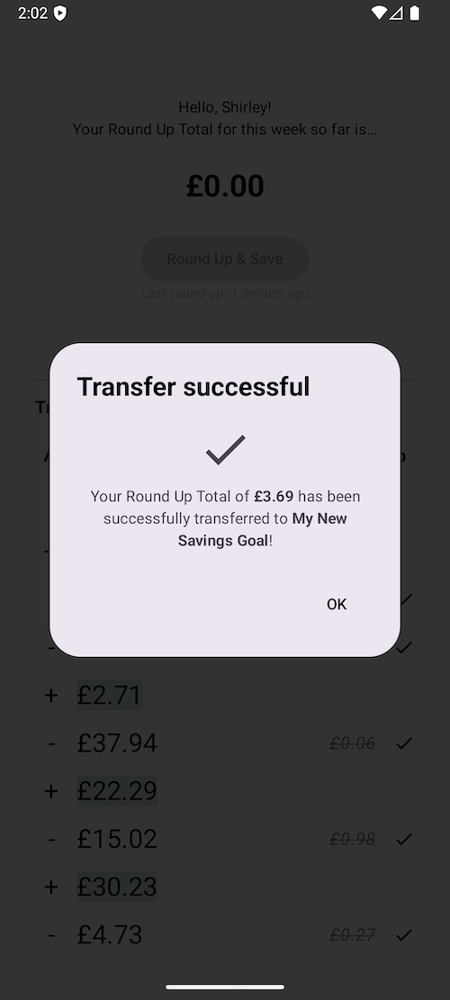

# Round-Up Feature for Starling Bank

This feature will take a feed of a customer's transactions and allow the user to "round up" — calculate a total of all their spare change (the remainder of a spending transaction when rounded to the nearest Pound), and allow them to put it to good use in a Savings Goal.

## About

This Android app was built in Android Studio and tested on mobile.
It is written in Kotlin, uses Hilt for dependency injection, Jetpack Compose for UI, Retrofit and Okhttp3 for the network layer, and JUnit and Hilt for testing (unit, instrumented, and end-to-end).

I followed an OOP/modularised approach, which Hilt encourages, for extensibility and testability.
DataStore is used for storing tokens (encrypted with a custom util) due to the deprecation of SharedPreferences. It is also used for storing the timestamp of the latest round-up, which works for this demo but hypothetically wouldn't work if the user had this app on multiple devices.

## Setup instructions

Since this a demo app, there is no OAuth flow, and so to initialise tokens and secrets need to be entered manually. This app has only been tested with the Sandbox API and a Sandbox Customer.

Please add the following into your "local.properties" file.

```
# Refresh token, to be used once to allow the app to initialise
refresh.token=XXXX

# Client keys
starling.clientId=XXXX
starling.clientSecret=XXXX
```

The refresh token will be used by the app once so it can get and store an initial access token. It will store and use the new refresh tokens returned by the API.
However, it must be there as a fallback in case the new refresh token expires for whatever reason.

## Screenshots of the flow

1. The user sees a list of transactions, and their potential round-up total, as well as the round-up amount for each spending transaction.


Explanation: Crossed-out round-up amounts indicate the transaction has already been included in a previous round-up, and so is no longer counted.
"Not counted" indicates a transaction that is an internal transfer, and not a spend, and as such is not valid to be counted in the round-up.

2. When clicking "Round Up & Save", the user will get an option of which Savings Goal they wish to transfer their Round-up Total to


They are also given the option of creating a new Savings Goal to transfer to.


3. The user is told if the transfer is successful...



4. And their homepage is updated to show their "cleared" total, and when they last rounded-up


